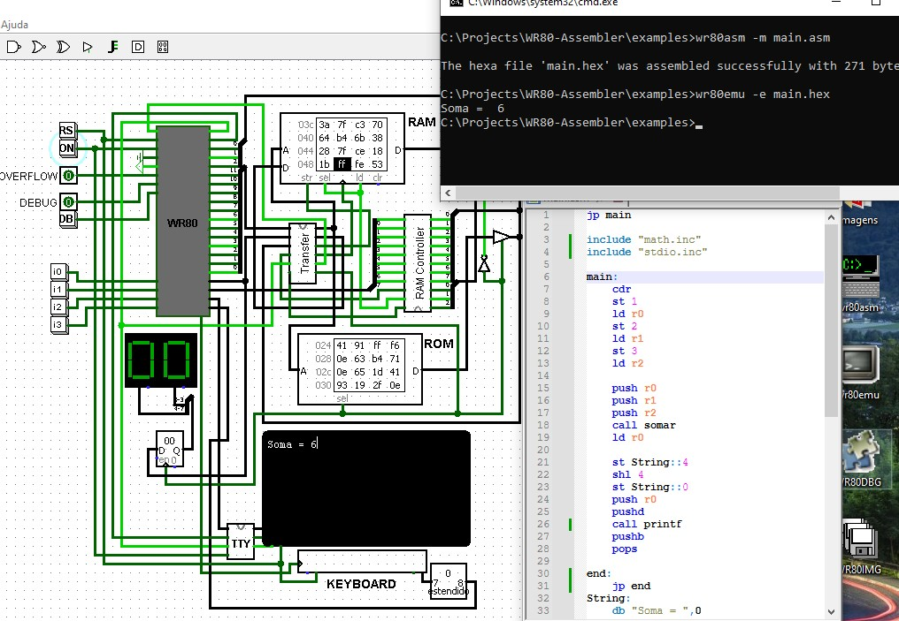

# WR80X Development Kit (WDK v1.8.0)

The WR80X Development Kit (WDK) is a complete toolchain for developing software in Assembly and C for the custom WR80X processor architecture.

It includes the WR80X Assembler, Debugger, Emulator, and a graphical Virtual Machine for testing and visualization.
The WDK provides a unified workflow for writing, compiling, debugging, and executing WR80X programs.
Designed for both learning and advanced development, it streamlines the entire process of building WR80X applications.



# ⚙️ Project Build & Run Guide

This document explains how to install the required tools, compile, and run the project on **Windows** and **Linux**. This WDK Project have the following tools:


| Tools       | Description   |
|-------------|---------------|
| `WR80ASM`   | Assembles WR80X assembly source files into machine code.                    |
| `WR80IMG`   | Creates and manages WR80X disk images, including WROFS-formatted volumes.   |
| `WR80EMU`   | Emulates the WR80X CPU to execute compiled programs.                        |
| `WR80DBG`   | Provides debugging capabilities for WR80X programs with interactive control.|
| `WR80VM`    | Runs graphical WR80X applications using the virtual machine environment.    |

---

## 📦 Project Requirements (WDK Contributing)

To build and run all components of the WDK for contributing, you must have the following dependencies installed:

### **🔷 GCC Compiler**
A C compiler is required for compiling all tools in the project.

- **Windows:**  
  You may use **GCC (MinGW-w64)** or **Dev-C++** (for IDE-based builds).

- **Linux:**  
  Ensure GCC is installed (usually preinstalled on most distributions).

---

### **🔶 SDL2 Library (Linux Only)**  
The **WR80VM** graphical virtual machine requires the SDL2 development package.

Install it using:

```bash
sudo apt install libsdl2-dev
```

---

# ⚙️ WDK Installation

The WDK provides all tools required to program, build, and run applications for the WR80X architecture.
Follow the steps below to install the toolkit and set up your development environment.

---

## ✔️ Windows Instructions

### 1. Install the required tools

All necessary tools are installed automatically. You can choose one of the following methods:

#### **Option A — Double-click**
Simply run: **install.bat** in the root directory

#### **Option B — Using the command line**

Open **Command Prompt** and execute:

```cmd
install
```

---

## ✔️ Linux Instructions

### 1. Make the script executable

If needed, grant execution permission to the build script:

```bash
chmod +x build.sh
```

### 2. Install all tools globally

Run:

```bash
./build.sh
```
This script performs the equivalent of a global make install of all tools used by the project.

---

## ▶️ Running the Project

Below are example commands for each tool included in the WDK.

---

### Assembler

Run the assembler to generate machine code from an assembly source:

```bash
wr80asm -m code.asm
```

### Emulator

Execute a compiled WR80X program:

```bash
wr80emu -e code.hex
```

### Debugger

Start debugging a WR80X program:

```bash
wr80emu -e code.hex -d
```

or:
```bash
wr80dbg -d code.hex
```

### Graphical Virtual Machine

Run the graphical VM with a binary image:

```bash
wr80vm graph.bin -c
```

### **Image Generator (wr80img)**

The **wr80img** tool is used to create and manage WR80X disk images.  
You can create empty images, insert raw files, or build images using the WROFS (WR80 Read-Only File System).

#### **Create a new image**
```bash
wr80img --create myos.img -l 4095
```

**Insert files individually**
```bash
wr80img -s kernel.bin -o myos.img -bs 256 -sk 1
```

**Build an image using WROFS formatting**
```bash
wr80img --format -s folder -o myos.img -b boot.bin
```

---

<a name="tutorial"></a>
# 💻 Assembly Tutorial

  ## Create your own Hello World Assembly program easier with Macros
  
```Assembly
include "wr80x.asm"

.jmp Main
  
Print:
  .loop.print:
    .cmp p2, 0
    .je .done.print
    .inb r0, p2
    .outb p3, r0
    .inc _p0_p1
    .jmp .loop.print
.done.print:
    .ret

Main:
    .Invoke Print, String
.END

String:
    db "Hello World!",0
```

